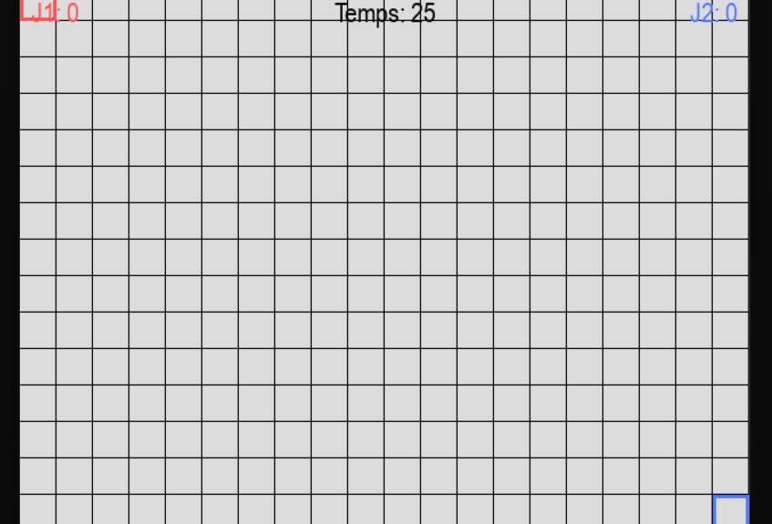

🎨 Pixel Painter Battle

Pixel Painter Battle is a local multiplayer game where two players compete to paint the most squares on a grid! Fast-paced, colorful, and fun for all ages.

🕹️ Game Concept

Two players (keyboard & mouse) color squares on a shared grid.

Random bonuses/maluses appear: slow down, double brush, etc.

Player with the most squares in their color when time runs out wins!

⚡ Features

🎛️ Configuration Menu (Tkinter): choose grid size, colors, view scores.

🖌️ Dynamic gameplay with Pygame.

🎵 Sounds & animations for a lively experience.

🏆 Score tracking for friendly competition.

🚀 How to Run
Install dependencies:
pip install -r requirements.txt

Launch the configuration menu:
python tkmenu.py

🗂️ Project Structure
PixelPainterBattle/
│
├─ main.py          # Entry point for Pygame gameplay
├─ painter.py       # Core painting game logic
├─ tkmenu.py        # Tkinter configuration menu & scores
├─ assets/          # Images, sounds, etc.
└─ README.md        # Project overview

🎨 Controls

Keyboard & mouse depending on player assignment.

Configurable from the Tkinter menu.

📦 Dependencies

pygame

tkinter
 (standard)

pillow
 (optional, for advanced assets)

 👾 Screenshots

 📝 License

MIT License © 2025 Ahmed Laminou

💡 Notes

This project is designed to explore the integration of Pygame and Tkinter for interactive games and menus. Perfect for prototyping and learning Python game development.